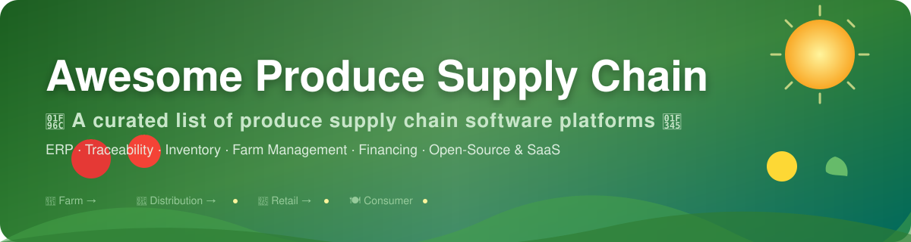

<!--
  SEO meta for crawlers / previews
-->
<meta name="description" content="Awesome Produce Supply Chain — a curated list of the best produce and agricultural supply chain software platforms: ERP, traceability, inventory, farm management, lot tracking, financing, and open-source alternatives with pricing and free tiers.">
<meta name="keywords" content="produce supply chain software, agricultural supply chain, farm ERP, food traceability software, produce ERP, lot tracking, inventory management, farm management software, open source ERP, agri supply chain, PTI, FSMA, EUDR">

# 🥬 Awesome-Produce-Supply-Chain

  

## 🏆 Top Produce Supply Chain Platforms

A curated list of leading software platforms for the **fresh produce and agricultural supply chain** — covering **ERP**, **inventory management**, **lot tracking**, **food traceability**, **grower accounting**, **distribution**, **supply chain financing**, and **quality management** for fruits, vegetables, and perishable goods.  
**Primary focus: open-source software.** 🌱

Commercial / hosted platforms are listed separately for completeness. Open-source alternatives and community tools are emphasized throughout. 🤝

> 📌 **Looking for?** → [SaaS pricing & free tiers](#-saas--hosted-platforms) · [Open-source options](#-open-source-softwares) · [Quick start recommendations](#-quick-start-recommendations)

---

## ☁️ SaaS / Hosted Platforms

> **Note:** Company-size figures are best-available public estimates (annual revenue, acquisition value, or raised funding) and may not be precisely comparable across companies.

| Platform | Company Size | Description | Key Focus | Pricing | Free Tier |
|----------|--------------|-------------|-----------|---------|-----------|
| **[Produce Pro Software](https://www.aptean.com/)** (Aptean) | ~$650M revenue (2024/25) | Purpose-built ERP for the fresh produce industry. Covers the full supply chain from growers to distributors: lot tracking, grower accounting, inventory, packing/repacking, sales, purchasing, WMS, and compliance (PTI, COOL). | End-to-end produce ERP & traceability | Enterprise quote; listed from ~$5,000 (Software Advice) | Free trial available |
| **[ProducePay](https://producepay.com/)** | $4.5B+ cumulative transactions; raised $38M (Series D, 2024) | Predictable commerce platform for fresh produce. Working capital financing, global trading network, shipment visibility, quality monitoring, and insights to reduce waste and improve grower-buyer relationships. | Produce financing + supply chain visibility | Fee-based (Quick-Pay factoring up to ~4% of invoice; up to 96% advance) | None (transaction fees) |
| **[TraceGains](https://tracegains.com/)** | $350M (2024 acquisition by Veralto); ~$30M revenue | Connected product development and supply chain collaboration platform for food & beverage. Digitized specs, supplier documents, compliance, formulation, packaging, and regulatory intelligence. | Specs, compliance & supplier collaboration | From ~$20,000/year (enterprise) | None |
| **[AgriDigital](https://www.agridigital.io/)** | $6B+ transacted annually; raised ~$25M AUD | Leading agri-commodity (especially grain) supply chain platform. Real-time inventory, contract management, trade execution, site operations, and finance tools for farmers, sites, traders, and brokers. | Grain & agri-commodity management | Free for growers; volume-based pricing for buyers/site operators | Free grower accounts |
| **[Markon](https://www.markon.com/)** | ~$33M revenue (~2026) | Cooperative produce purchasing, logistics, quality standards, and branding partner for major North American foodservice distributors. Focuses on specifications, food safety, and premium produce brands rather than pure software. | Produce standards, sourcing & foodservice quality | Cooperative membership (not a software license) | Free mobile app / public resources |
| **[AGR Dynamics](https://www.agrdynamics.com/)** | ~$11M revenue (~2026) | Inventory optimization and supply chain planning software. Demand forecasting, automatic ordering, ABC analysis, exception reporting, and ERP bolt-on capabilities for wholesale and retail. | Inventory optimization & demand planning | Custom quote (priced by inventory value managed) | Demo on request |
| **[Blue Link ERP](https://www.bluelinkerp.com/)** | ~$5.6M revenue | Distribution-first ERP with strong inventory, lot tracking, multi-warehouse, EDI, order management, and accounting. Suitable for food, produce, and perishable distributors. | Wholesale/distribution ERP with lot control | From ~$1,000/month (GetApp) | Free trial/demo on request |
| **[FreshByte Software](https://www.freshbyte.com/)** | ~$5.5M revenue | Inventory and accounting system for wholesale food distribution (produce, meat, fish, grocery). Real-time cost tracking, lot traceability, profitability, and compliance with food safety regulations. | Wholesale food distribution ERP | From ~$5,000/year (G2/Software Advice estimate) | Free trial on request |
| **[Cibus](https://cibus-dx.com/)** (or related food integrity tools) | ~$5.5M revenue (DELIMAX GmbH) | Traceability and food integrity solutions focused on transparency, quality data, origin authentication, and certification across the agricultural value chain. | Food integrity, traceability & authenticity | Custom enterprise quote (no public price list) | None (quote-based) |
| **[Wherefour](https://wherefour.com/)** | ~$1.4M ARR (bootstrapped) | Cloud manufacturing and traceability ERP built for makers. Real-time inventory, barcode labeling, multi-facility transfers, catch weights, and compliance tools. Popular with food, beverage, and CPG producers. | Manufacturing + lot-level traceability | From ~$600/month (Software Advice & GetApp) | Free trial + free version available |

---

## 🐙 Open-Source Softwares

Open-source options for produce and agricultural supply chains are growing, especially around farm management, lot/batch traceability, inventory, and ERP foundations. Fully specialized produce ERP systems are less common than general agri/ERP tools that can be customized. 🚀

### 🧱 Core Frameworks & Agricultural / Supply Chain Platforms

| Project | Stars | Description | License | Notes |
|---------|-------|-------------|---------|-------|
| **[Odoo Community](https://www.odoo.com/)** + Agriculture / Inventory modules |  | Modular open-source ERP with inventory, manufacturing, purchase, sales, and community agriculture/traceability extensions. Widely used and highly customizable. | LGPLv3 | Large ecosystem; many agri-related community modules |
| **[ERPNext](https://github.com/frappe/erpnext)** |  | Full open-source ERP with strong inventory, batch/expiry tracking, lot/serial number traceability, quality inspection, multi-warehouse, manufacturing, and an Agriculture module for crops, land units, and treatments. Excellent base for produce distributors and processors. | GPL-3.0 | Most practical full open-source ERP for agri/produce |
| **[farmOS](https://github.com/farmOS/farmOS)** |  | Web-based farm management and record-keeping application. Tracks crops, assets, activities, sensors, and maps. Strong for on-farm data that feeds into supply chain systems. | GPL-2.0 | Leading open-source farm record system |
| **[Ekylibre](https://github.com/ekylibre/ekylibre)** |  | Open-source Farm Management Information System (FMIS). Manages farm operations, accounting, and connects farms to the broader ecosystem. | AGPL-3.0 | Comprehensive FMIS |
| **[INATrace](https://zerodeforestationhub.eu/)** (and similar DIASCA tools) |  | Open-source digital traceability and farm management solution for agricultural commodities. Supports field mapping, production documentation, and compliance (e.g., EUDR). | Open source | Traceability-focused digital public good |
| **[AgriOS](https://github.com/advanceinsight/AgriOS)** |  | Open-source ERP built on Odoo Community, designed for agri-SMEs and cooperatives. Integrates operations with supply chain traceability and EUDR compliance focus. | Dual (LGPLv3 + MPL-2.0) | Strong for smallholder & cooperative supply chains |

### 🛠️ Specialized Libraries & Related Tools

| Project | Stars | Description | Focus Area |
|---------|-------|-------------|---------|
| **[metasfresh](https://github.com/metasfresh/metasfresh)** |  | Open-source ERP with manufacturing, inventory, and trade features that can be adapted for food/produce operations. | Flexible open-source ERP |
| **[OpenFarm](https://github.com/openfarmcc/OpenFarm)** |  | Free and open database + API for farming and gardening knowledge (crops, growing guides, and schemas). Useful reference data layer for produce supply chains. | Open ag data / gardening knowledge |
| **[Open Food Network](https://github.com/openfoodfoundation/openfoodnetwork)** |  | Open-source platform connecting farmers, food hubs, and buyers — online shops, local food systems, and short supply chains for produce and other foods. | Local food / short supply chains |
| **[Apache OFBiz](https://github.com/apache/ofbiz-framework)** |  | Full-featured open-source ERP and e-commerce framework. Inventory, procurement, accounting, and manufacturing can be extended with lot tracking and quality modules for produce. | General open-source ERP |
| **[FarmBot](https://github.com/FarmBot/Farmbot-Web-App)** |  | Open-source precision agriculture — the web app that plans and controls FarmBot CNC farming devices (seeding, watering, weeding). | Precision farming / open hardware |
| **[OpenBoxes](https://openboxes.com/)** |  | Open-source warehouse and inventory management system with shipment tracking and forecasting capabilities. Useful for distribution nodes in produce chains. | WMS / inventory |
| **[iDempiere](https://github.com/idempiere/idempiere)** |  | Open-source ERP/CRM built on the ADempiere/Compiere heritage with OSGi architecture. Supply chain and inventory capabilities extendable for produce operations. | General open-source ERP |
| **[Tryton](https://github.com/tryton/tryton)** |  | Modular open-source ERP framework with a robust kernel and strong accounting/inventory modules; can be tailored for agri-food supply chains. | Modular open-source ERP |
| **[FoodTraze / Hyperledger-based solutions](https://github.com/hyperledger-foodtraze)** |  | Blockchain-based open-source food traceability networks (Hyperledger Fabric). End-to-end lifecycle tracking with QR codes and farmer mobile apps. | Blockchain food traceability |
| **[TraceFoodChain](https://agstack.org/)** (Linux Foundation AgStack) |  | Open-source tool for tracing agricultural products from farm to market, supporting smallholders and EUDR compliance. | Farm-to-market traceability |
| **[Gleba](https://gleba.fr/)** |  | Open-source management software for diversified micro-farms (market gardening, orchards, livestock). Planning, interventions, stocks, and basic traceability. | Micro-farm management |
| **QR / lot traceability apps** (various community projects) | — | Multiple open-source Vue/Django/React systems for generating QR codes and tracking produce lots from farm to consumer. | Simple product traceability |

### ⭐ Additional Notable Open-Source Tools

| Project | Stars | Description | Focus Area |
|---------|-------|-------------|---------|
| **[Paperless-ngx](https://github.com/paperless-ngx/paperless-ngx)** |  | Open-source document management system (DMS) with OCR, tagging, and full-text search — excellent for supplier certificates, audit trails, and compliance documents. | Document & compliance |
| **[Nextcloud](https://github.com/nextcloud/server)** |  | Self-hosted collaboration and file platform. Centralize supplier documents, certificates, and quality records with end-to-end encryption and audit-friendly sharing. | Document & collaboration |
| **[Node-RED](https://github.com/node-red/node-red)** |  | Flow-based programming tool for wiring together devices, APIs, and services — popular for cold-chain temperature/humidity monitoring and IoT sensor integrations. | IoT & sensor data |
| **[Hyperledger Fabric](https://github.com/hyperledger/fabric)** |  | Enterprise-grade permissioned blockchain framework used for immutable food provenance and traceability networks. | Blockchain provenance |
| **[QGIS](https://github.com/qgis/QGIS)** |  | Professional open-source GIS for mapping fields, plots, land units, and logistics routes — supports farmOS and other agri-data workflows. | GIS / farm mapping |
| **[Frappe Framework](https://github.com/frappe/frappe)** |  | Full-stack web application framework (the engine behind ERPNext) — a strong base for building produce-specific grower accounting, catch-weight handling, or PTI labeling. | App framework |
| **[Dolibarr](https://github.com/dolibarr/dolibarr)** |  | Modular open-source ERP/CRM with invoicing, stock, and e-commerce modules that can be extended with lot tracking and quality modules for produce. | General open-source ERP |

**Note:** Specialized produce features such as grower settlements, price-after-sale, complex repacking, and full PTI/GS1 compliance are more mature in commercial systems. Open-source stacks (especially ERPNext + farmOS + custom modules) provide a strong, low-cost foundation that many organizations extend successfully. 💪

---

## ⚡ Quick Start Recommendations

| Goal | Recommended Starting Point |
|------|---------------------------|
| Full open-source ERP with lot/batch & agri modules | **ERPNext** |
| Farm-level record keeping & planning | **farmOS** or **Ekylibre** |
| Cooperative / smallholder supply chain + traceability | **AgriOS** or **INATrace** |
| Warehouse & inventory for distribution | **OpenBoxes** + ERPNext |
| Blockchain / immutable food provenance | **FoodTraze** or AgStack TraceFoodChain |
| Specialized produce ERP (commercial) | **Produce Pro Software** (Aptean) |
| Distribution ERP with lot tracking | **Blue Link ERP** or **FreshByte** |
| Manufacturing + strong traceability | **Wherefour** |
| Specs, compliance & supplier collaboration | **TraceGains** |
| Produce financing + visibility | **ProducePay** |
| Grain / commodity focus | **AgriDigital** |

---

## 🤝 Contributing

Contributions, corrections, and new open-source projects are welcome.  
Please open an issue or pull request. 🙏

---

**Last updated:** August 2026 📅  
Emphasizing open-source tools while documenting the major commercial platforms for context. Open-source options are strongest in farm management, general ERP with batch tracking, and emerging traceability tools; highly specialized produce ERP features often still require commercial solutions or significant customization. 📈
